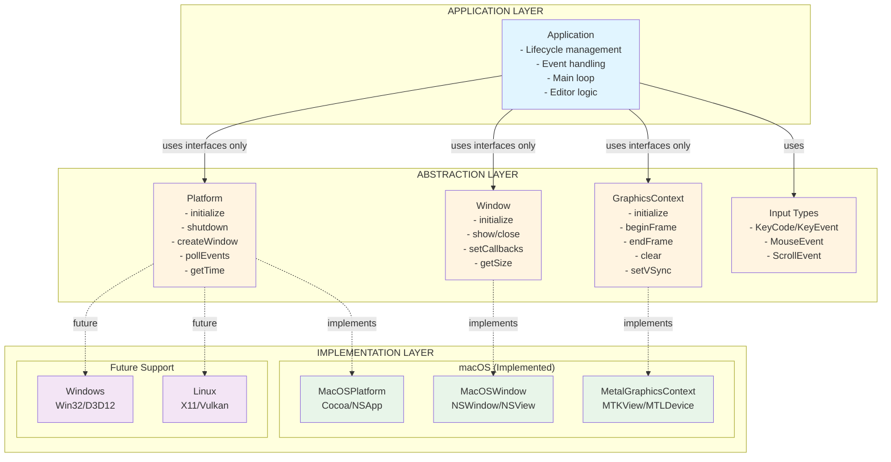
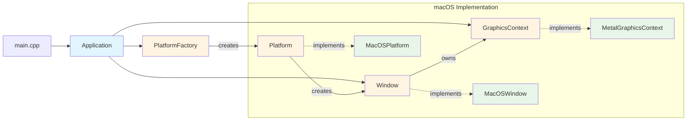

<div align="center">
    <picture>
      <source media="(prefers-color-scheme: dark)" srcset="resources/icon.png">
      
    </picture>
  <h1>Drite Code Editor</h1>
</div>

A modern C++23 code editor with complete OS abstraction. Built with Metal (macOS), designed for Vulkan (Linux) and DirectX (Windows).

## Features

- **Zero External Dependencies** - Pure C++23 with OS-native APIs
- **Full Platform Abstraction** - Application code is 100% OS-independent
- **Modern C++23** - Latest language features and best practices
- **Native Graphics** - Metal, Vulkan, and DirectX support
- **Scalable Architecture** - Clean separation between editor and platform layers

## Architecture Overview

Drite uses a three-layer architecture that completely abstracts OS-specific implementations from application logic.

### Architectural Layers



### Component Relationships



## Project Structure

```
drite/
├── src/
│   ├── application/              # Application layer (OS-independent)
│   │   ├── application.h
│   │   └── application.cpp
│   │
│   ├── platform/                 # Platform abstraction
│   │   ├── platform.h           # Abstract Platform interface
│   │   ├── platform_factory.h
│   │   ├── platform_factory.cpp
│   │   └── macos/               # macOS implementation
│   │       ├── macos_platform.h
│   │       └── macos_platform.mm
│   │
│   ├── window/                   # Window abstraction
│   │   ├── window.h             # Abstract Window interface
│   │   └── macos/               # macOS implementation
│   │       ├── macos_window.h
│   │       └── macos_window.mm
│   │
│   ├── graphics/                 # Graphics abstraction
│   │   ├── graphics_context.h   # Abstract GraphicsContext interface
│   │   └── macos/               # Metal implementation
│   │       ├── metal_graphics_context.h
│   │       └── metal_graphics_context.mm
│   │
│   ├── input/                    # Input type definitions
│   │   └── input_types.h
│   │
│   └── main.cpp                  # Entry point
│
├── resources/
│   ├── icon.png                  # Source icon (1024x1024)
│   ├── macos/                    # macOS-specific resources
│   │   ├── Info.plist
│   │   ├── AppIcon.icns
│   │   └── generate_icon.sh
│   ├── linux/                    # Linux resources (future)
│   └── windows/                  # Windows resources (future)
│
├── build/                        # Build artifacts (gitignored)
├── Makefile                      # OS-independent build system
├── README.md
└── LICENSE
```

## Requirements

### macOS
- macOS 13.0 or later
- Xcode Command Line Tools
- clang++ with C++23 support

### Linux (Future)
- X11 or Wayland
- Vulkan SDK
- gcc/clang++ with C++23 support

### Windows (Future)
- Windows 10/11
- DirectX 12
- MSVC or clang-cl with C++23 support

## Building

The build system automatically detects your platform and uses the appropriate settings.

### Quick Start

```bash
# Build the executable
make

# Build and run
make run

# Clean build artifacts
make clean

# Show build information
make info

# Show all available targets
make help
```

### macOS-Specific Targets

```bash
# Create .app bundle
make app

# Generate app icon from resources/icon.png
make icon

# Create distributable .dmg
make dmg

# Install to /Applications (refreshes icon cache)
make install

# Uninstall from /Applications
make uninstall

# Run the .app bundle
make run-package
```

### Platform-Agnostic Targets

```bash
# Create platform package (.app, .deb, or installer)
make package

# Create distribution package (.dmg, .deb, or .msi)
make dist
```

## Key Design Principles

### 1. Complete OS Abstraction
- Application layer contains **zero** platform-specific code
- All OS APIs hidden behind abstract base classes (`Platform`, `Window`, `GraphicsContext`)
- Platform-specific code isolated in implementation directories (`macos/`, `linux/`, `windows/`)

### 2. Factory Pattern
- `PlatformFactory` automatically selects correct platform at compile-time
- Platform detection via preprocessor (`#ifdef __APPLE__`, `#ifdef __linux__`, etc.)
- Single point of platform instantiation

### 3. Modern C++23
- `std::print`/`std::println` for formatted output
- `[[nodiscard]]` attributes for error-prone return values
- `constexpr` for compile-time evaluation
- `std::unique_ptr` for clear ownership semantics
- `= default` for compiler-generated functions
- Default member initializers: `bool m_running{false};`
- Strongly-typed enums (`enum class`)
- Explicit constructors

### 4. Clean Include Paths
- Base include directory: `src/`
- Compiler flag: `-Isrc`
- Clean includes: `#include "platform/platform.h"`
- No relative paths: ❌ `#include "../platform.h"`
- No transitive directories needed

### 5. OS-Independent Build System
- Single Makefile works on macOS, Linux, and Windows
- Automatic platform detection via `uname`
- Platform-specific source filtering
- Platform-specific linker flags
- Unified command interface across all platforms

## Architecture Benefits

1. **Platform Independence** - Application code requires zero changes when adding new platforms
2. **Testability** - Interfaces can be mocked for comprehensive unit testing
3. **Maintainability** - Clear separation of concerns with well-defined boundaries
4. **Extensibility** - New platforms only require implementation, not redesign
5. **Performance** - Zero runtime overhead; virtual calls only at layer boundaries
6. **Scalability** - Editor features added without touching platform code
7. **Modern** - Leverages C++23 for safety, expressiveness, and performance

## Adding New Platforms

Adding Windows or Linux support requires **zero** changes to the application layer:

1. Create platform implementations:
   - `src/platform/windows/win32_platform.cpp` or `src/platform/linux/linux_platform.cpp`
   - `src/window/windows/win32_window.cpp` or `src/window/linux/x11_window.cpp`
   - `src/graphics/windows/d3d12_graphics_context.cpp` or `src/graphics/linux/vulkan_graphics_context.cpp`

2. Update `PlatformFactory`:
   ```cpp
   #elif defined(_WIN32)
       return std::make_unique<Win32Platform>();
   #elif defined(__linux__)
       return std::make_unique<LinuxPlatform>();
   ```

3. Makefile automatically handles:
   - Platform detection
   - Source file filtering (excludes `macos/` on Linux/Windows)
   - Appropriate linker flags
   - Package creation

**Application layer remains unchanged!**

## Roadmap

### Phase 1: Core Platform Support ✅
- [x] macOS implementation with Metal
- [x] OS-independent architecture
- [x] Build system with platform detection
- [x] App bundling and distribution

### Phase 2: Multi-Platform (In Progress)
- [ ] Linux implementation with Vulkan
- [ ] Windows implementation with DirectX 12
- [ ] Cross-platform testing

### Phase 3: Editor Features
- [ ] Text buffer system (gap buffer or piece table)
- [ ] Syntax highlighting engine
- [ ] Multi-cursor support
- [ ] Command palette
- [ ] File tree sidebar
- [ ] Status bar
- [ ] Split views
- [ ] Themes

### Phase 4: Advanced Features
- [ ] LSP (Language Server Protocol) support
- [ ] Git integration
- [ ] Terminal integration
- [ ] Extension system
- [ ] Vim keybindings

## Development

### Code Style
- Modern C++23 idioms
- 4-space indentation
- `snake_case` for variables/functions
- `PascalCase` for classes
- `m_` prefix for member variables
- Comprehensive documentation comments

### Testing
```bash
# Run tests (when implemented)
make test
```

### Contributing

Contributions welcome! Please ensure:
- Code follows the existing style
- Platform abstractions are maintained
- No OS-specific code in application layer
- Documentation is updated

## License

MIT License - Copyright (c) 2026 Drew Worden

See [LICENSE](LICENSE) for details.

---

<div align="center">
  <sub>Built with ❤️ by Drew Worden</sub>
</div>
