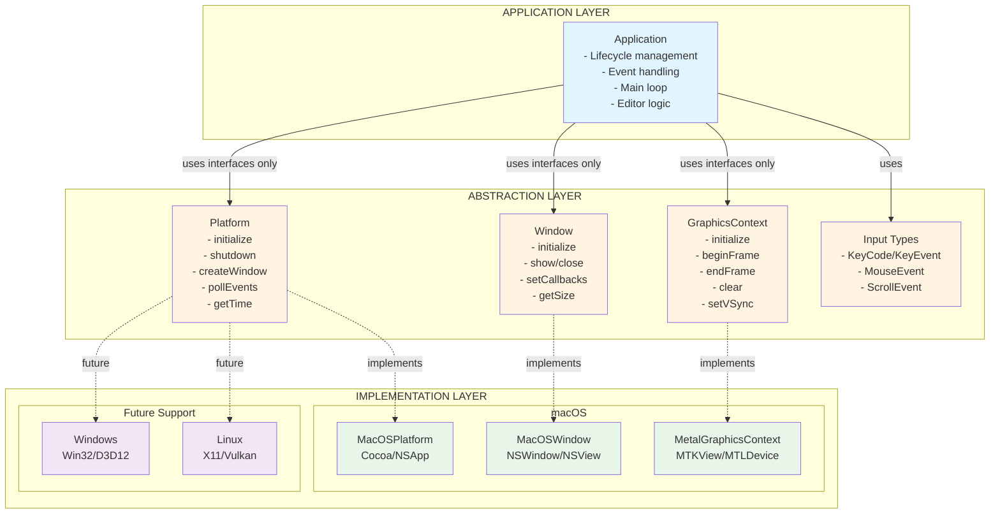
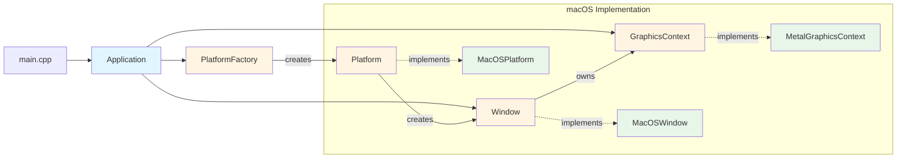
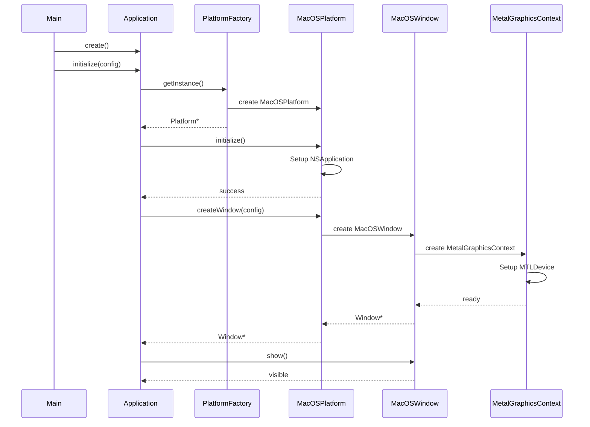
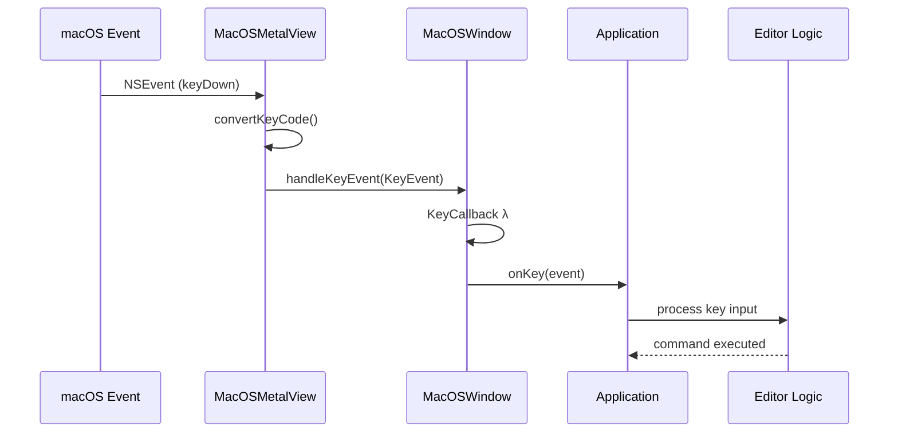
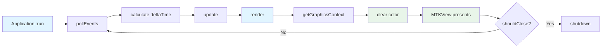

# Drite Code Editor

A modern C++ code editor built with a fully abstracted, platform-independent architecture.

## Architecture Overview

Drite is designed with clean separation between application logic and OS-specific implementations, enabling scalable development focused on editor functionality.

### Architectural Layers



### Component Relationships



### Data Flow - Initialization



### Data Flow - Event Handling



### Data Flow - Render Loop



## Project Structure

```
src/
├── application/              # Application layer
│   ├── application.h
│   └── application.cpp
│
├── platform/                 # Platform abstraction
│   ├── platform.h           # Abstract interface
│   ├── platform_factory.h
│   ├── platform_factory.cpp
│   └── macos/               # macOS implementation
│       ├── macos_platform.h
│       └── macos_platform.mm
│
├── window/                   # Window abstraction
│   ├── window.h             # Abstract interface
│   └── macos/               # macOS implementation
│       ├── macos_window.h
│       └── macos_window.mm
│
├── graphics/                 # Graphics abstraction
│   ├── graphics_context.h   # Abstract interface
│   └── macos/               # Metal implementation
│       ├── metal_graphics_context.h
│       └── metal_graphics_context.mm
│
├── input/                    # Input type definitions
│   └── input_types.h
│
└── main.cpp                  # Entry point
```

## Key Design Principles

### 1. Abstraction Through Interfaces
- All OS-specific functionality hidden behind abstract base classes
- Application layer only interacts with abstract interfaces
- No platform-specific types or APIs exposed to higher layers

### 2. Factory Pattern
- `PlatformFactory` creates appropriate platform implementation
- Compile-time platform detection (`#ifdef __APPLE__`)
- Single point of platform selection

### 3. Modern C++ (C++23)
- `std::print`/`std::println` for formatted output
- `[[nodiscard]]` attributes for important return values
- `constexpr` for compile-time constants
- `std::unique_ptr` for ownership management
- `= default` for constructors
- Default member initializers: `bool m_running{false}`
- Strongly-typed enums (`enum class`)

### 4. Clean Include Paths
- Base include directory: `src/`
- Compiler flag: `-Isrc`
- Clean includes: `#include "platform/platform.h"`
- No relative paths like `../platform.h`

## Building

```bash
# Build the project
make

# Clean build files
make clean

# Build and run
make run
```

## Requirements

- C++23 compatible compiler (clang++ on macOS)
- macOS (Metal support required)
- Xcode Command Line Tools

## Architecture Benefits

1. **Platform Independence**: Application code has zero platform-specific code
2. **Testability**: Interfaces can be mocked for unit testing
3. **Maintainability**: Clear separation of concerns
4. **Extensibility**: New platforms add implementations without changing abstractions
5. **Performance**: No runtime overhead - virtual calls only at layer boundaries
6. **Scalability**: Editor features can be added without touching platform code

## Adding New Platforms

To add Windows or Linux support:

1. Implement `Platform` interface → `Win32Platform` / `LinuxPlatform`
2. Implement `Window` interface → `Win32Window` / `X11Window`
3. Implement `GraphicsContext` interface → `D3D12GraphicsContext` / `VulkanGraphicsContext`
4. Update `PlatformFactory` with `#ifdef _WIN32` / `#ifdef __linux__`
5. Update build system

**Application layer requires ZERO changes!**

## Future Editor Features

### Text Buffer System
- Line buffer management
- Gap buffer or piece table
- Syntax highlighting
- Multi-cursor support

### UI System
- Command palette
- Status bar
- Sidebar/file tree
- Text rendering with ligatures

### Command System
- File operations (open, save, close)
- Edit operations (cut, copy, paste, undo/redo)
- View operations (split, zoom, theme)

## License

MIT License - Copyright (c) 2026 Drew Worden

See [LICENSE](LICENSE) for details. 